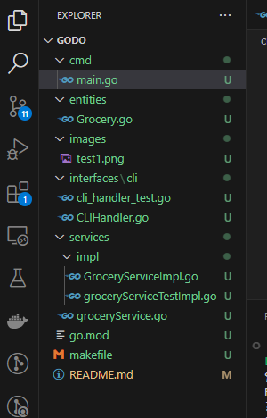
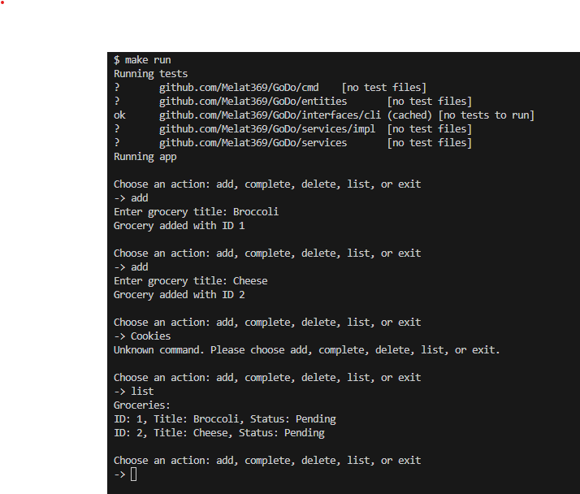

# Grocery List Organizer

## Description
The **Grocery List Organizer** is a simple command-line tool that helps users manage their grocery items. Users can:
- Add grocery.
- List grocery

This project demonstrates the use of **Go slices**, **maps**, and **error handling** as covered in Lessons 2.1, 2.3, and 2.4 of the course. It utilizes maps to organize grocery items by category, slice manipulation for adding and deleting items, and includes error handling for invalid entries or non-existent items.

### Skills Covered:
- **Arrays/Slices**: Managing grocery items using slices for dynamic data storage.
- **Maps**: Using maps to categorize grocery items for efficient look-up and organization.
- **Error Handling**: Handling errors for invalid user inputs and attempts to delete non-existent items.
- **Bonus Feature**: Sorting items alphabetically within each category.

## Features
- **Add grocery**: Users can add grocery groceries to specific categories.
- **List grocery**: Users can list all groceries in a given category.
- **Delete groceries**: Users can delete groceries by name and category.
- **Error handling**: Ensures only valid entries are processed, and informs users if something goes wrong (e.g., deleting an item that doesn't exist).
- **Bonus**: Groceries in each category are sorted alphabetically (optional feature).

## Installation

1. Clone this repository to your local machine:

    ```bash
    git clone https://github.com/Melat369/GoDo.git
    cd GoDo
    ```

2. Install Go if you don't have it installed yet. You can download Go from the official website: [Go Downloads](https://golang.org/dl/).

3. Initialize and run the Go application:

    ```bash
    go run cmd/main.go
    ```

## Usage

### Commands:
- **Add Item**: Add a new item to a category.
  
  Example:
  ```bash
  add milk Dairy
  ```

- **Sort Items**: Sort items alphabetically within each category.

    Example:
    ```bash
    sort Dairy
    ```
- **Example Run**
  ```sh
  > add milk Dairy
  > add eggs Dairy
  > add bread Bakery
  > list Dairy
  [Milk, Eggs]
  > delete eggs Dairy
  > list Dairy
  [Milk]
  ```
## Project Structure and Sample Tests
**Project Structure**

  
  
**Sample Tests**

  

## Contributors

The following people have contributed to this project:

- **John Doe**  
  GitHub: [Melat Tesfaye](https://github.com/Melat369)  
  Email: [melat.tesfaye.123456@gmail.com](mailto:melat.tesfaye.123456@gmail.com)

- **Jane Smith**  
  GitHub: [GetinetAmareGitHub](https://github.com/gama1221)  
  Email: [getinet.neu@gmail.com](mailto:geitnet.new@gmail.com)

- **Alex Brown**  
  GitHub: [YohansSamuelGitHub](https://github.com/YohansSamuel)  
  Email: [YohansSamuel@gmail.com](mailto:YohansSamuel@gmail.com)
## Course Instructor

- **Dawit Elias Gebremariam**  
  Email: [dawiteliaskassaye@gmail.com](mailto:dawiteliaskassaye@gmail.com)  
  LinkedIn: [Dawit Elias LinkedIn](https://www.linkedin.com/in/dawit-elias-gebremariam/)
---
